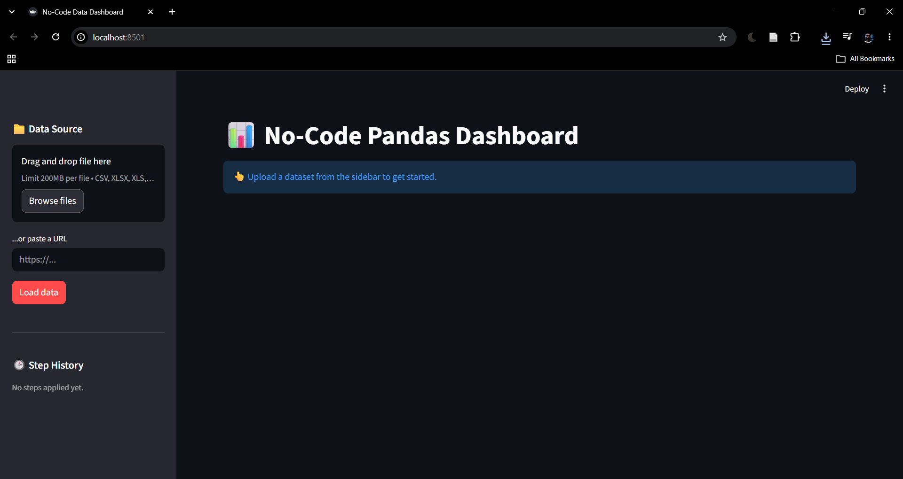
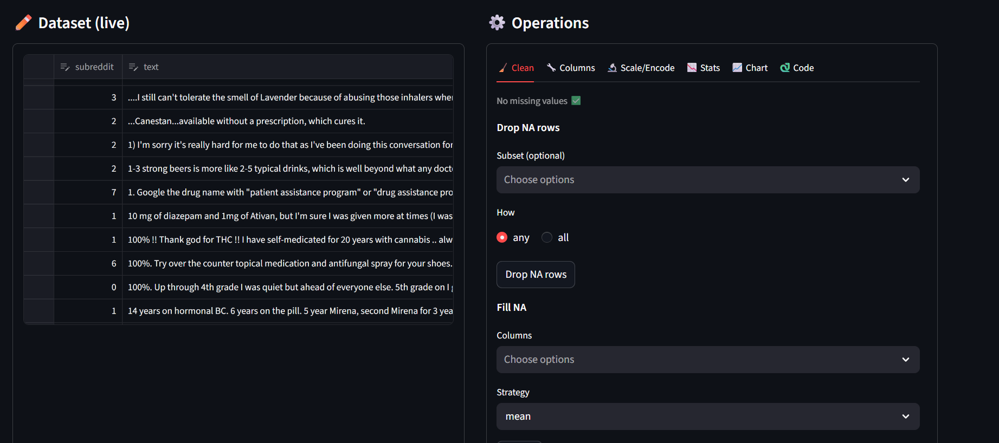
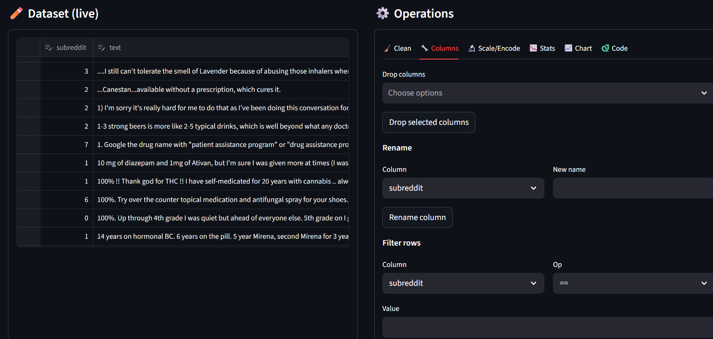
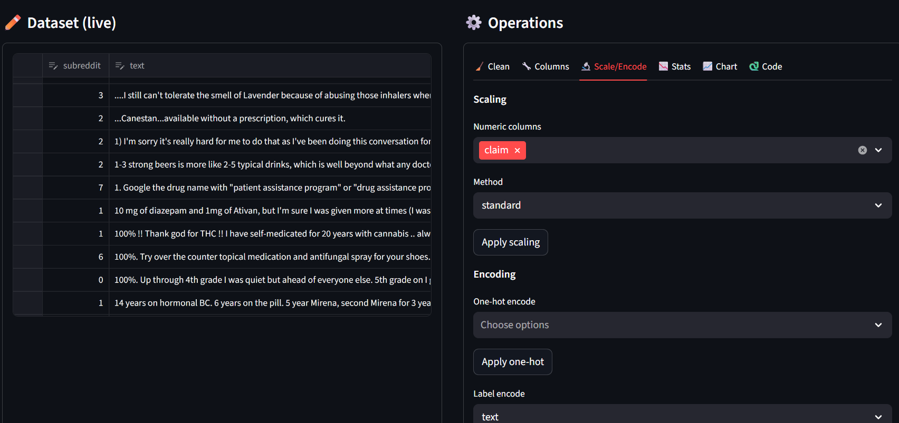
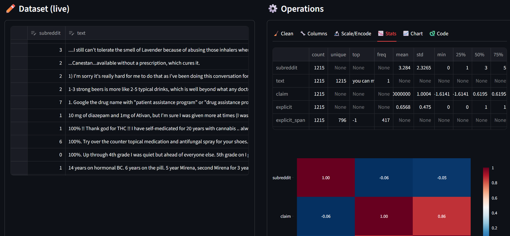
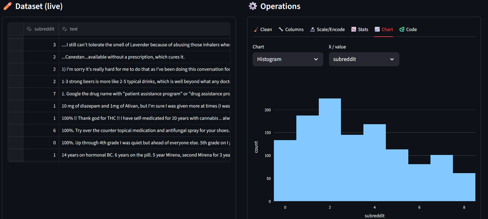
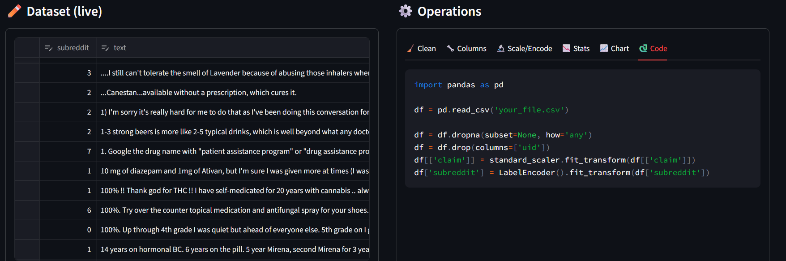
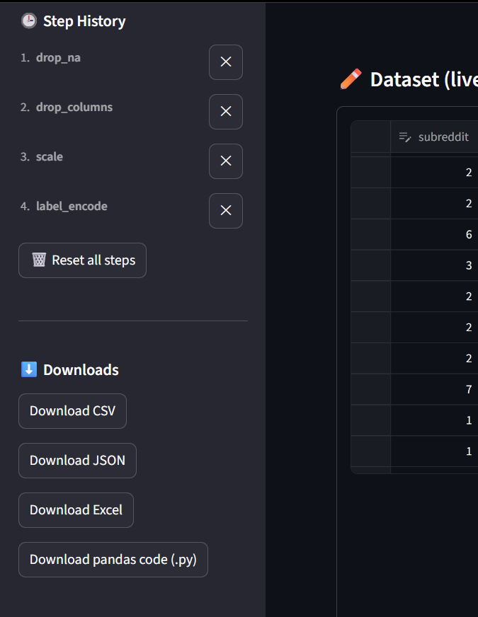

# NoCode-DataAnalysis-Dashboard

> A no-code Streamlit app for **real pandas data analysis** - upload any dataset, edit it live, clean it, scale/encode it, visualize it, and export both the cleaned data *and* the equivalent Python code. All from a single UI, no Python required.

Built for anyone who wants to explore, clean, and transform data through point-and-click controls while still learning the pandas code behind every action.

---

## Table of Contents

- [Features](#features)
- [Screenshots](#screenshots)
- [How It Works](#how-it-works)
- [Installation](#installation)
- [Usage](#usage)
- [Supported Operations](#supported-operations)
- [Project Structure](#project-structure)

---

## Features

- **Bring your own dataset** - upload CSV, Excel, or JSON, or load directly from a URL.
- **Live spreadsheet editor** - add, edit, or delete rows and cells directly in the browser, with edits tracked as a real pipeline step.
- **Full cleaning toolkit** - drop or fill missing values (mean/median/mode/constant/ffill/bfill), drop duplicates, change column dtypes.
- **Column & row control** - select or drop columns, rename columns, filter rows by condition (`==`, `!=`, `>`, `<`, `contains`, etc.).
- **Scaling & encoding** - Standard/MinMax/Robust scaling, one-hot encoding, and label encoding for categorical columns.
- **Instant statistics** - summary stats (`describe()`), correlation heatmap, and value counts, updated live as you transform the data.
- **Six chart types** - histogram, box, scatter, bar, line, and pie, built with Plotly and driven entirely by dropdowns.
- **Step history with undo** - every operation is logged as a step; remove any individual step or reset the whole pipeline, and the dataset recomputes automatically.
- **Auto-generated pandas code** - every click generates the equivalent pandas line, so you can learn the code behind the UI as you go.
- **Export everything** - download the cleaned dataset as CSV, JSON, or Excel, or download the full pipeline as a standalone `.py` script.

---

## Screenshots

### 1. Upload & Explore Dataset
Upload a CSV, Excel, or JSON file (or load from a URL) and instantly see your dataset in the live editor with row/column/missing-value metrics at a glance.



### 2. Clean Your Data
Drop or fill missing values, remove duplicates, and change column dtypes - all without writing a single line of pandas.



### 3. Manage Columns & Rows
Drop unwanted columns, rename columns inline, and filter rows using simple condition builders.



### 4. Scale & Encode
Apply Standard/MinMax/Robust scaling to numeric columns, or one-hot/label encode categorical columns for downstream ML use.



### 5. Instant Stats
See summary statistics, a live correlation heatmap, and value counts for any column - updated automatically as your pipeline changes.



### 6. Build Charts on the Fly
Choose from histogram, box, scatter, bar, line, or pie charts and pick your columns - no charting code required.



### 7. Auto-Generated Pandas Code
Every operation you apply through the UI is mirrored as real pandas code, so you can copy it out or just learn from it.



### 8. Step History & Downloads
Track every step you've applied, undo any individual one, and download your cleaned dataset (CSV/JSON/Excel) or the full pipeline script - all from the sidebar.



---

## How It Works
```
Your CSV/Excel/JSON → original_df (untouched)
           │
           ▼
steps = [{name, params}, ...]
           │
           ▼
current_df = replay(original_df, steps)
                │
┌───────────────┼────────────────┐
▼               ▼                ▼
Live Editor Clean/Transform Stats & Charts
(edit cells) (NA, scale, (describe, corr,
encode, filter) histograms, etc.)
               │
               ▼
Export: CSV / JSON / Excel / pipeline.py
```

Every operation is stored as a step rather than mutating data directly. The working dataset is always recomputed by replaying the full step list on the original upload - this is what makes undo, step removal, and code generation work for free.

---

## Installation

```bash
git clone https://github.com/Ravevx/NoCode-DataAnalysis-Dashboard.git
cd NoCode-DataAnalysis-Dashboard

conda create -n dash-env python=3.11
conda activate dash-env

pip install -r requirements.txt
```

## Usage

```bash
streamlit run app.py
```

Then in your browser:

1. **Upload a dataset** from the sidebar (CSV, Excel, JSON, or a direct URL).
2. **Edit live** in the data editor on the left - add rows, change cells, then click "Apply manual edits" to log it as a step.
3. **Clean, transform, and analyze** using the tabs on the right - Clean, Columns, Scale/Encode, Stats, Chart, and Code.
4. **Review your pipeline** anytime in the sidebar's Step History - remove any step or reset entirely.
5. **Export** your cleaned dataset (CSV/JSON/Excel) or the auto-generated pandas script directly from the sidebar downloads.

---

## Supported Operations

| Category | Operations |
|---|---|
| Cleaning | Drop NA (row/column, any/all/threshold), fill NA (mean/median/mode/constant/ffill/bfill), drop duplicates, change dtype (str/int/float/datetime/category) |
| Editing | Select columns, drop columns, rename columns, filter rows (`==`, `!=`, `>`, `<`, `>=`, `<=`, `contains`), manual cell edits |
| Scaling | Standard, MinMax, Robust |
| Encoding | One-hot encoding, label encoding |
| Stats | `describe()`, correlation matrix + heatmap, value counts |
| Charts | Histogram, box, scatter, bar, line, pie |
| Export | CSV, JSON, Excel, standalone pandas `.py` script |

---

## Project Structure
```
├── app.py # Streamlit UI - live editor, operations panel, sidebar
├── transforms/
│ ├── _init_.py
│ ├── cleaning.py # drop_na, fill_na, drop_duplicates, change_dtype
│ ├── editing.py # select/drop/rename columns, filter_rows, manual edits
│ ├── scaling.py # standard/minmax/robust scaling
│ └── encoding.py # one-hot and label encoding
├── tests/
│ ├── test_cleaning.py
│ ├── test_editing.py
│ ├── test_scaling.py
│ └── test_encoding.py
├── assets/ # Screenshots used in this README
└── requirements.txt
```

---

Issues and pull requests are welcome. If you add a new transform, chart type, or export format, please update the tables above.
